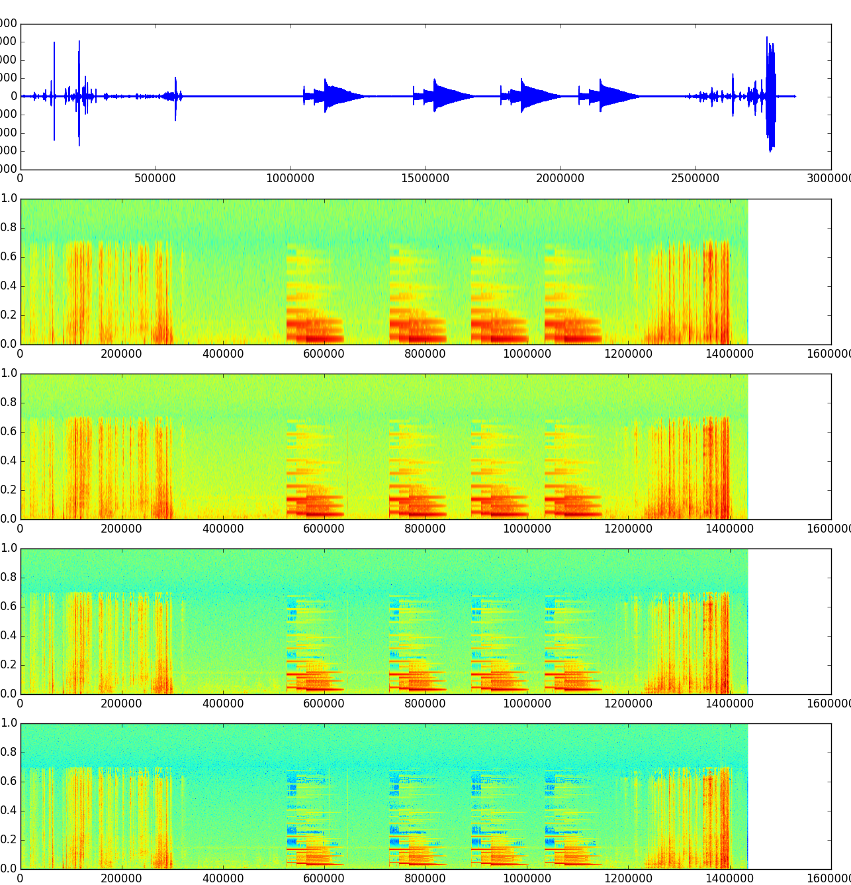
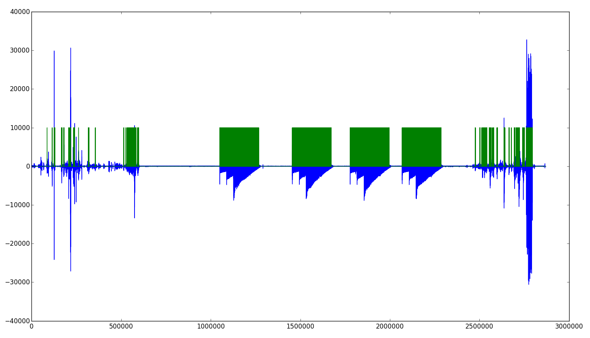
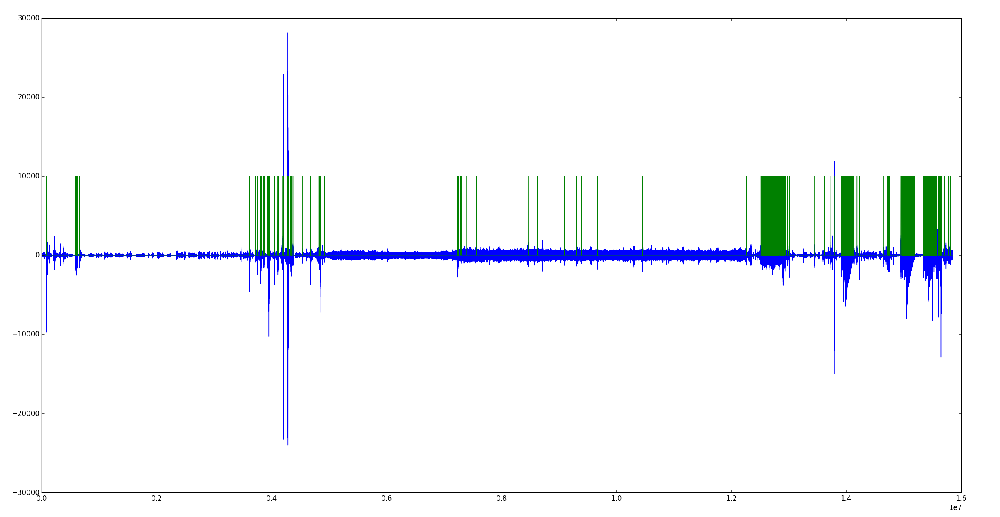

# Ring Tone Recoginition

## Introduction

## Restrictions

* Seems that the teensy can only do a window of 256 samples (without running out of memory).

## Steps

### view_waveform.py

#### Data

* Bell 1 (1050210-1277290)
    * Tone 1: 1050210 - 1088990
    * Tone 2:  - 1127350
    * Tone 3:  - 1277290
* Bell 2 (1455410-1682420)
    * Tone 1: 1455410 - 1493870
    * Tone 2:  - 1532500
    * Tone 3:  - 1682420
* Bell 3 (1777920-2005890)
    * Tone 1: 1777920 - 1816660
    * Tone 2:  - 1855110
    * Tone 3:  - 2005890
* Bell 4 (2068090-2295410)
    * Tone 1: 2068090 - 2106850
    * Tone 2:  - 2145600
    * Tone 3:  - 2295410

# Mini-Analysis

* Avg tone 1 length (until tone 2 starts) 38780, 38460, 38740, 38760 = 38.685 
* Avg bell length: 227080, 227010, 227970, 227320 = 181.876 

### view_spectogram.py

* See the tones at around 600k, 800k, ...
* You can clearly see much higher frequencies in the lower plots, mainly because of the larger FFT window. The lower window also seems promising, because the tone is very clearly.
* The door bell is clearly overlapping three different tones each time. 

# Generating Input for the Neural Net

## Second experiment traindata_mix.generate_spectogram_old

Simple example to generate the FFT of a window from the data (window length=256) and a step size (sampling rate divider) of 2 resulted in a pickle file size of over 4 GB. This is unacceptable. 
Further ideas: 
* use a generator and feed the neural net directly (this makes scaling difficult, but the maximum FFT value could be determined upfront).
* try to reduce the amount of data somehow. We need this much data only for the first few tries, after that we can use the neural net to determine which data might be worth focusing on (because the weights would be highest along these data paths).

## Third experiment traindata_mix.generate_spectogram_iterator

* Only the first half of the frequencies are used
* Only the real part of the frequencies are used
* Amplitude is scaled to 1/2^16 (max amplitude in the source)

Resulting file size is still over 3GB when pickled, but can now be iterated

# Training the neural net

## test_001 - Neural net of 128 - 128*5 - 128*5 - 2

__Thoughts:__
* Used 01_ring.wav
* Uses a network with two hidden layers which count of neurons are multiples of the window size of the fft (also the frequencies).
* Two hidden layers just for fun.
* The train, val and test data are cut from the 01_ring.wav by taking a good look on it and using the easiest path to cut the data.
* So far, THEANO uses all CPU's and easily more than 19GB of RAM. Searching for something to cut down RAM usage (or using a larger machine...)

__Results:__
* Larger machine found a solution with a accuracy of 87.30 %
    * Used Amazon EC2, with 32 CPU's and a huge junk of memory (only around 10GB was used) and used around 3000 minutes of CPU time (top) = $12.11
* Large junks of no bell sounds where recognized also, will have to look at the data if these audio-frames can actually be differentiated with the given FFT data.
* Second figure shows the neural net on a new set of data (nn was not trained, validated, tested on). The four large (partly green) blocks at the end are the door bell.

